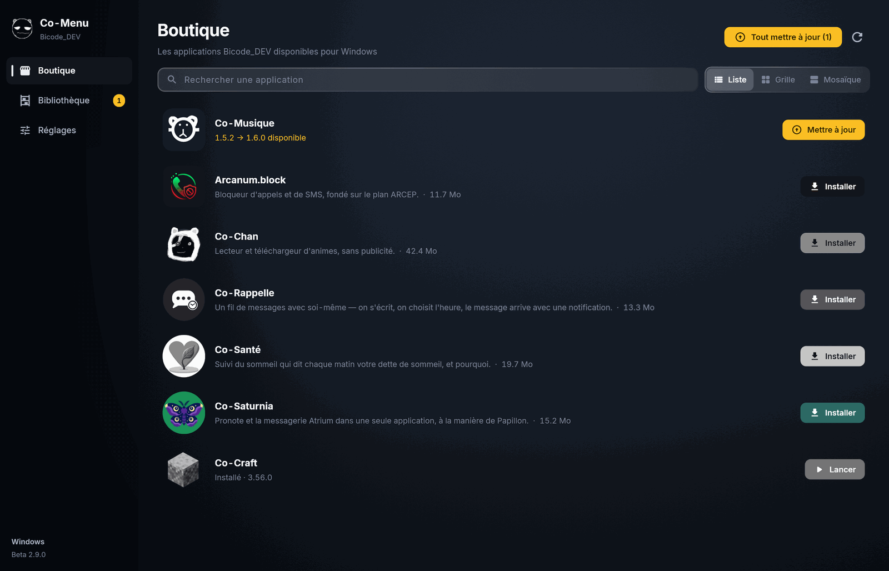
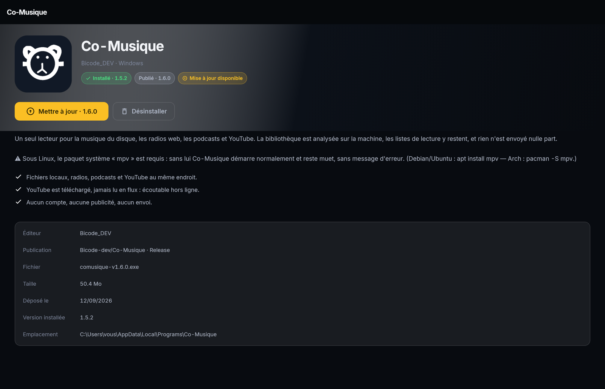
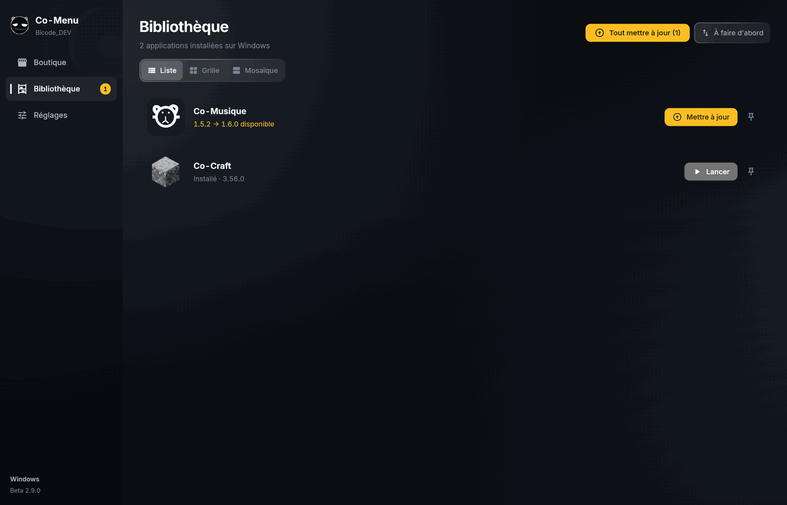
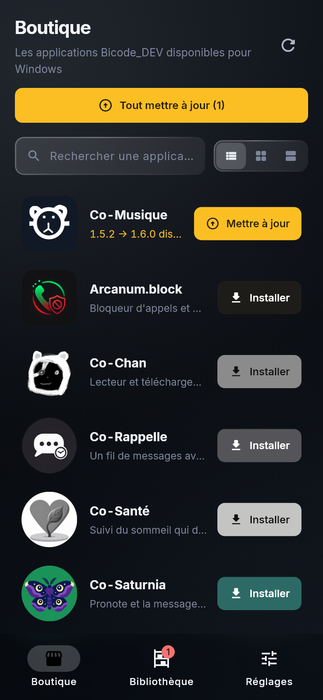
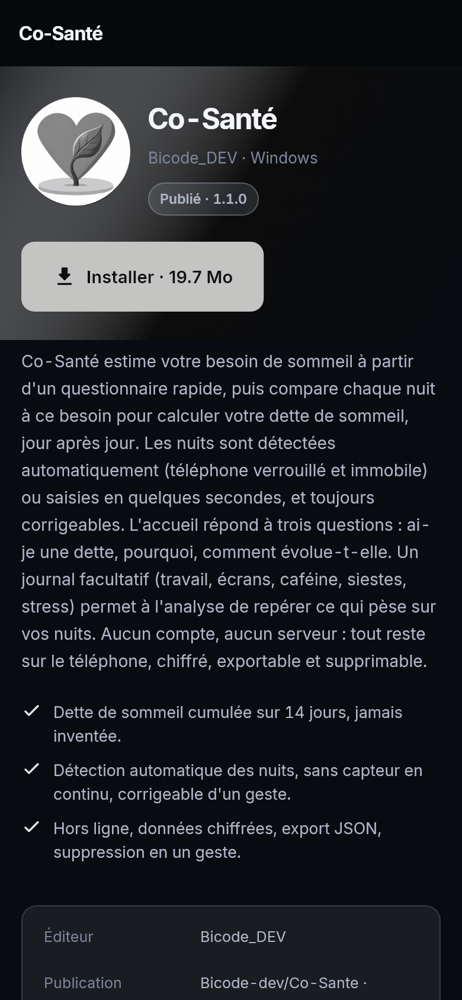

<h1 align="center">🌌 Co-Menu</h1>

  <b>Toutes vos applications Bicode. Un seul endroit.</b> 
  Installez, mettez à jour et lancez — sans chercher un lien, sans guetter une version.

  
  
  
  
  

  <a href="https://github.com/Bicode-dev/Co-Menu/releases/tag/Release"><b>⬇️ Télécharger Co-Menu</b></a>

---

## Aperçu

*La boutique sur Windows : toutes les applications publiées, avec « Installer », « Lancer » ou « Mettre à jour » selon ce qui est déjà sur la machine.*

*La fiche d'une application : ce qu'elle fait, ce qui est publié, les nouveautés de la version, et le seul bouton qui compte.*

*La bibliothèque : ce qui est installé, avec la version, un bouton « Tout mettre à jour » quand il y a du retard, et l'épingle pour garder une application en tête.*

*La même boutique sur Android, en liste.*

*Une fiche sur Android, avant d'installer.*

---

## Le problème, tel qu'il se pose

Vous avez installé Co-Craft il y a trois mois. Une version 3.48 est sortie
depuis — vous ne le savez pas. Vous voulez réinstaller Co-Chan sur votre
nouveau téléphone : il faut retrouver le dépôt, ouvrir les publications,
choisir le bon fichier parmi cinq, comprendre lequel est fait pour votre
machine.

**Co-Menu supprime toute cette étape.** Vous ouvrez, vous voyez vos
applications, vous cliquez. C'est tout.

## Ce que vous y gagnez

### 🎯 Vous ne voyez que ce qui marche chez vous

Sur téléphone, on ne vous montre que ce qui existe en APK. Sous Windows, que ce
qui a un installeur. Sous Linux, que ce qui a une version Linux. Pas de carte
grisée, pas de « bientôt disponible », pas de téléchargement qui finit sur un
fichier inutilisable. Ce que vous voyez, vous pouvez l'installer.

### ⚡ Les mises à jour vous trouvent

Une pastille sur l'application, le numéro d'avant et le numéro d'après, un
bouton. Sous Windows, la mise à jour se fait **sur place** : pas de fenêtre
d'installation qui repose les mêmes questions, pas de raccourcis en double.

### 🚀 Un seul bouton, quel que soit le système

Installer sous Windows, sous Linux et sur Android, ce sont trois mécaniques
complètement différentes. Co-Menu les connaît toutes les trois et vous n'en
voyez aucune : vous appuyez sur **Installer**, puis sur **Lancer**.

### 🌌 Et c'est beau

Un fond de galaxie animé, des panneaux en verre dépoli, six thèmes — ou votre
propre image en fond d'écran, avec le flou que vous choisissez, au pourcentage
près.

---

## Les applications disponibles

<table>
<tr>
<td width="60" align="center">⛏️</td>
<td>

**Co-Craft** — *Launcher Minecraft*
Comptes Microsoft, versions, Forge et Fabric, modpacks Modrinth, sauvegarde des
mondes. Vos jetons de compte sont chiffrés au repos et effacés après la partie.

💻 Windows · 🐧 Linux

</td>
</tr>
<tr>
<td width="60" align="center">🌸</td>
<td>

**Co-Chan** — *Lecteur et téléchargeur d'animes*
Recherche, liste de suivi, reprise là où vous vous étiez arrêté, saut de
générique, lecture hors ligne. Aucun compte, aucune publicité.

💻 Windows · 🐧 Linux · 📱 Android

</td>
</tr>
</table>

> Le catalogue s'étoffera. Co-Menu vous préviendra — c'est son métier.

---

## Installation

<table>
<tr><th>Système</th><th>Fichier à prendre</th><th>Ensuite</th></tr>
<tr>
  <td>🪟 <b>Windows</b></td>
  <td><code>comenu-v…​.exe</code></td>
  <td>Double-cliquez. L'installeur fait le reste.</td>
</tr>
<tr>
  <td>🐧 <b>Linux</b></td>
  <td><code>comenu-v…​-linux-x64.tar.gz</code></td>
  <td>Décompressez, puis <code>./install.sh</code>. Aucun <code>sudo</code>.</td>
</tr>
<tr>
  <td>📱 <b>Android</b></td>
  <td><code>comenu-v…​.apk</code></td>
  <td>Ouvrez le fichier et autorisez l'installation.</td>
</tr>
</table>

  <a href="https://github.com/Bicode-dev/Co-Menu/releases/tag/Release"><b>➜ Aller aux téléchargements</b></a>

Une fois installé, Co-Menu se tient à jour tout seul.

---

## Pourquoi vous pouvez lui faire confiance

Co-Menu télécharge des programmes et les exécute sur votre machine. C'est
exactement le genre d'outil dont il faut se méfier. Voilà donc ce qui est tenu,
et rien de plus :

| | |
|---|---|
| 🔒 **Un seul interlocuteur** | Co-Menu ne parle qu'à GitHub. Toute autre adresse est refusée — même si c'est le serveur lui-même qui la propose. |
| 📦 **Un catalogue fermé** | La liste des applications est inscrite dans le programme. Rien ne peut y être ajouté à distance. |
| 🔍 **Ce qui arrive est vérifié** | La taille est comparée à celle annoncée par GitHub, l'empreinte SHA-256 vous est montrée. Un fichier qui ne correspond pas est supprimé sans être ouvert. |
| 🙈 **Rien sur vous** | Aucun compte, aucune publicité, aucune statistique d'usage, aucun identifiant d'appareil. Aucun journal écrit sur le disque. |
| ✍️ **Signé Bicode_DEV** | Le nom de l'éditeur apparaît dans les propriétés du fichier sous Windows. Sur Android, une copie signée par quelqu'un d'autre ne peut pas s'installer par-dessus. |
| 🚫 **Rien sans vous** | Aucune application n'est installée, mise à jour ou retirée sans que vous l'ayez demandé. |

**Et ce qui n'est pas tenu :** Co-Menu n'est pas un antivirus. Il vérifie d'où
vient un fichier et qu'il est arrivé intact — pas ce qu'il contient. Une
protection surestimée est pire qu'une protection absente : elle fait baisser la
garde.

Un contrat d'utilisation vous est présenté au premier démarrage. Le bouton
« J'accepte » ne s'active qu'une fois le texte parcouru — parce qu'un bouton
actif au-dessus d'un texte non lu ne recueille pas un accord, seulement un
réflexe.

---

## Questions

<b>C'est vraiment gratuit ?</b>

Oui. Pas de version payante, pas d'abonnement, pas de fonctionnalité réservée,
pas de publicité, pas de revente de données — il n'y a aucune donnée à revendre.

<b>Que devient une application déjà installée à la main ?</b>

Co-Menu la reconnaît et reprend la main dessus : il lit ce que l'installeur a
enregistré sur le système. Vous n'avez rien à désinstaller au préalable.

<b>Est-ce que ça installe des choses en douce ?</b>

Non. Co-Menu regarde ce qui est publié, et s'arrête là. Le téléchargement part
quand vous appuyez sur le bouton.

Une seule exception, assumée : **Co-Menu se met à jour lui-même, et cette
mise à jour est obligatoire.** Un outil qui installe des programmes ne peut pas
se permettre de vieillir : le jour où un défaut y est trouvé, le correctif ne
sert à rien s'il reste optionnel.

<b>Et si je n'ai plus internet ?</b>

Vos applications installées restent visibles et se lancent normalement. Co-Menu
vous dit simplement que les versions n'ont pas pu être vérifiées, et affiche les
dernières qu'il connaissait.

<b>Comment je désinstalle ?</b>

Comme n'importe quelle application, par les réglages de votre système. Co-Menu
ne laisse rien derrière lui, et les applications qu'il a installées restent
installées.

<b>Sur quoi c'est écrit ?</b>

Flutter et Dart, une seule base de code pour Windows, Linux et Android. Le code
est en français, commentaires compris.

---

  Co-Menu — édité par <b>Bicode_DEV</b> · <a href="https://github.com/Bicode-dev">github.com/Bicode-dev</a> 
  Logiciel fourni « en l'état », sans garantie. Vos sauvegardes restent votre affaire.

